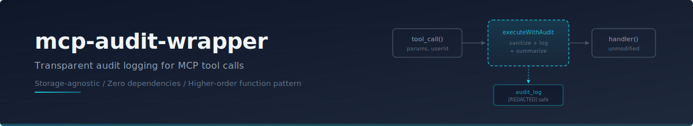
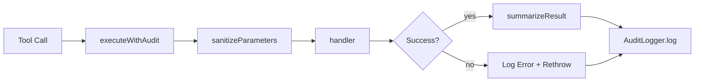

<p align="center">
  
</p>

<p align="center">
  <a href="https://github.com/protectyr-labs/mcp-audit-wrapper/actions/workflows/ci.yml"></a>
  <a href="LICENSE"></a>
  <a href="https://www.typescriptlang.org/"></a>
  <a href="https://www.npmjs.com/package/@protectyr-labs/mcp-audit-wrapper"></a>
</p>

<p align="center">
  Transparent audit logging HOF for MCP tool calls. Storage-agnostic, zero dependencies.
</p>

---

## How It Works

A higher-order function wraps any async handler with automatic audit logging. The tool being wrapped has no idea it is being observed. Parameters are sanitized (secrets redacted, large values truncated), results are summarized, and every call is logged through a storage-agnostic interface you provide.



## Quick Start

```bash
npm install @protectyr-labs/mcp-audit-wrapper
```

```typescript
import { executeWithAudit, createConsoleLogger } from '@protectyr-labs/mcp-audit-wrapper';

const logger = createConsoleLogger();

const result = await executeWithAudit(
  logger,
  'user-123',          // userId
  'get_customer',      // toolName
  { customerId: 'c-1' },
  async () => db.customers.findOne('c-1')
);
// Logs: { userId, toolName, parameters, result: { success: true, data: {...} }, timestamp }
```

## Why This Exists

MCP servers expose tools that AI models call autonomously. In production, you need to know who called what, with which parameters, and whether it worked. The naive approach is adding logging to every handler, but that creates boilerplate, inconsistency, and the constant risk of logging raw secrets.

This library solves it with a single higher-order function. Wrap your handler once. Audit logging happens transparently. The tool code stays clean.

- **One HOF, zero boilerplate** -- wrap any handler in one line, get full audit trail
- **Smart sanitization** -- redacts keys containing `password`, `token`, `secret`; truncates strings > 500 chars; summarizes arrays > 10 items
- **Errors logged, then rethrown** -- audit is observability, not control flow
- **Storage-agnostic** -- implement `AuditLogger` interface for your backend (Postgres, file, console, anything)

## Use Cases

**Compliance and regulated industries.** Healthcare, finance, legal: any system handling sensitive data needs audit trails. Wrap your data access functions to log who accessed what, when, without storing the actual sensitive content in audit logs.

**Incident response and forensics.** When investigating a security incident, every analyst action must be traceable. This wrapper creates an automatic chain of custody: who ran which tool, with what parameters, and whether it succeeded or failed.

**MCP server observability.** You have built an MCP server with 10+ tools. Users are calling them via Claude. You need to know which tools are used most, which fail, and what parameters people pass, without reading every conversation.

**Multi-tenant SaaS.** Multiple organizations share the same tools. Audit logs track which user from which org performed each action. The userId parameter ties every operation to an identity.

**PII-safe logging.** Standard logging captures everything, including passwords and tokens in parameters. This wrapper automatically redacts sensitive fields so your logs are safe to store, search, and share with auditors.

## API

| Export | Description |
|--------|-------------|
| `executeWithAudit(logger, userId, toolName, params, handler)` | Wrap an async handler with audit logging |
| `sanitizeParameters(params)` | Redact secrets and truncate large values |
| `summarizeResult(result)` | Compact summary for storage (arrays, objects, primitives) |
| `createConsoleLogger()` | Dev-mode console logger; implement `AuditLogger` for production |

## Custom Logger

```typescript
import type { AuditLogger, AuditEntry } from '@protectyr-labs/mcp-audit-wrapper';

const pgLogger: AuditLogger = {
  async log(entry: AuditEntry) {
    await db.query(
      'INSERT INTO audit_log (user_id, tool, params, success, error, ts) VALUES ($1,$2,$3,$4,$5,$6)',
      [entry.userId, entry.toolName, JSON.stringify(entry.parameters),
       entry.result.success, entry.result.error, entry.timestamp]
    );
  },
};
```

## Design Decisions

| Decision | Rationale |
|----------|-----------|
| HOF over middleware | Composes with any async function. No framework dependency. Works in MCP servers, API routes, queue handlers, or plain scripts. |
| Rethrow after logging | Audit is observability, not control flow. Swallowing errors would change application behavior. |
| Truncate at 500 chars | Audit logs are for debugging, not data storage. A 50KB file content parameter would blow up log storage. |
| Redact by key name | Simple pattern matching catches most sensitive fields without configuration. May over-redact (e.g., "keyboard" contains "key"), which is an acceptable trade-off. |

See [ARCHITECTURE.md](./ARCHITECTURE.md) for the full decision records and alternatives considered.

## Limitations

- No async timeout on audit writes (slow storage blocks the handler)
- Parameter sanitization is shallow (does not recurse into nested objects)
- Redaction by key name only -- values are not inspected

## Origin

Built for [mcp-exec-team](https://github.com/protectyr-labs/mcp-exec-team), where multi-persona AI debates need a tamper-evident audit trail. Extracted as a standalone package because audit logging is a universal concern for any MCP server in production.

> [!NOTE]
> This library wraps any async function, not just MCP tool handlers. If you have a function and you want an audit trail, this works.

## License

MIT
